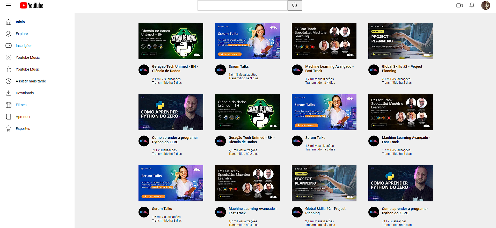

## 👨‍💻 Desafio de Projeto CSS: Reproduzindo a Listagem do YouTube com Grid Layout no CSS
Projeto de HMTL e CSS de clone da lista de vídeos na página do Youtube utilizando Flexbox e Grid.  
Esse projeto foi proposto pela professora Michele Ambrosio no curso de Formação CSS Developer - Dio.

## 💻 Tecnologias usadas:
  ***HTML5 & CSS3***

## 🖥 Preview:
 

## ⚙ Execução desse projeto:
1. **Clonar Repósitório:** basta utilizar o comando `git clone` para clonar esse projeto e salvar na máquina e depois executar o arquivo `index.html`.
2. **GitHubPages:** pode também acessar o projeto nesse [link](https://viniciusldiniz.github.io/desafio-de-pojeto-CSS/), que abrirá esse projeto no GitHubPages, sem precisar baixar o repositório na sua máquina.

